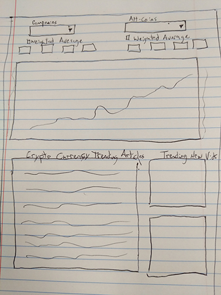

crypt-O-lytics
===============

### Team Name

thecryptkeepers

### Team Members

-   Christine Pablo

-   Darren Kay

-   Kevin Murtaugh

### Rough Breakdown of Tasks

-   Christine (Team Lead/Front End Support)

-   Darren (Development Lead)

-   Kevin (Concept / Data Normalization / Back End Support)

### Project Title

Bitcoin Bits n' Pieces –Crypt-O-Lytics

### Project Description

Build a multi-variate comparison tool suitable for charting mainstream
investment vehicles against less-common or non-publicly-traded data series. It
is left to the users to define what to compare & also to determine any
correlation or non-correlation among different data series.

### APIs to Be Used

* IEX Trading
* CryptoCompare

### Sketch of Final Product

### Link to Trello

https://trello.com/b/NCoYAh5A/bitcoin-bits-n-pieces

### Link to Our Repo

https://github.com/cmpablo/Bitcoin-Bits-and-Pieces
